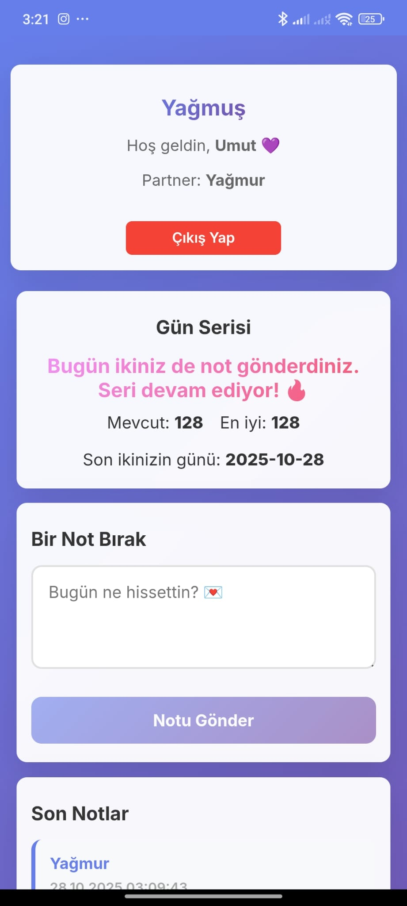

<!-- ===================================================== -->
<!-- 🌧️ Yağmuş App - README.md -->
<!-- Built and loved by Umut Özcan 💜 -->
<!-- ===================================================== -->

<h1 align="center">🌧️ Yağmuş App 💜</h1>

<p align="center">
  <em>A private space for two — share one note a day and keep your hearts in sync.</em><br/>
  <strong>React + Node.js + PostgreSQL + Railway</strong>
</p>

<p align="center">
  
  
  
</p>

---

## 💡 About

**Yağmuş App** is a minimalist, two-user web application built to strengthen communication through daily notes.  
Each user can post **only one note per day**.  
If both users share a note on the same day, the **daily streak** continues — symbolizing emotional consistency over time 💫

---

## 🧠 How It Works

- Only **two private accounts** exist.  
- Each user may post **one note per day**.  
- When both users post on the same day, the streak increases by **+1**.  
- The dashboard displays:
  - Current and best streak counts  
  - Recent notes from both users  
  - “Leave a Note” input area  
  - Partner username  

---

## ⚙️ Tech Stack

| Layer | Technology | Description |
|:------|:------------|:-------------|
| 🎨 **Frontend** | React (CRA) + Axios + CSS | Responsive UI, API communication |
| ⚙️ **Backend** | Node.js + Express | REST API + business logic |
| 🗄️ **Database** | PostgreSQL / SQLite (via Railway) | Stores notes and user info |
| 🔐 **Auth** | JWT (JSON Web Token) | Secure login / session handling |
| ☁️ **Hosting** | Railway | Full-stack deployment (frontend + backend) |

---

## 🎨 Frontend Highlights

- **Responsive Design:** Optimized for mobile, tablet, and desktop  
- **Minimal UI:** Soft purple tones `#667eea`, rounded cards, clean spacing  
- **Features:**
  - Dashboard (streak + recent notes)
  - Login / Register pages
  - PWA support (installable app, custom icons, manifest)
- **Friendly Messages:**  
  If a user tries to post a second note, a soft alert appears:  
  > “You’ve already shared your note today 💌 It’s saved in their heart 💜”

---

## 🔒 Backend Highlights

- **Express.js REST API** with modular structure  
- **JWT authentication middleware**  
- **One-note-per-day rule** enforced with status `409`  
- **UTF-8 support** (emojis 💜🔥🌸 handled safely)  
- **CORS** restricted to approved domains  
- Optional **React build serving** for full-stack hosting  

---

## 🗄️ API Endpoints

| Method  | Endpoint        | Description |
|:--------|:----------------|:-------------|
| `GET`   | `/api/health`   | API status (`{"ok":true}`) |
| `POST`  | `/api/register` | Register a new user |
| `POST`  | `/api/login`    | Authenticate and return JWT token |
| `GET`   | `/api/notes`    | List all notes |
| `POST`  | `/api/notes`    | Add a note *(JWT required, 1 per day)* |

---

## 🚀 Deployment

**Frontend** → `https://yagmusapp.up.railway.app`  
**Backend** → `https://yagmusappv100-backend-production.up.railway.app`

**Frontend Build Settings**
```bash
Root Directory: /frontend
Publish Directory: build
Start Command: npx serve -s build -l $PORT
```

---

## 💻 Local Setup

**1. Clone**
git clone https://github.com/UmutOZCN/YagmusAppV1.0.0.git

**2. Install backend dependencies**
cd backend
npm install

**3. Install frontend dependencies**
cd ../frontend
npm install

**4. Run backend**
npm start

**5. Run frontend**
cd ../frontend
npm start

🟢 Backend → http://localhost:3001
🟣 Frontend → http://localhost:3000

---

## 💜 Example Dashboard

```text
[Daily Streak: 127 🔥]

Both of you shared your notes today — the streak continues 💌
--------------------------------------------------------------
You: “The weather was perfect today 💜”
Partner: “I thought the same ☀️”
```

---

## 🖼️ Screenshots

### 📱 Mobile View

<p align="center">
  
  
  
  
</p>

---

### 💻 Desktop View

<p align="center">
  
  
</p>

---

## 👤 Developer

**Name:** Umut Özcan  
**Version:** 1.0.0  
**Description:**  
A minimalist web application designed to connect two people through daily notes.  
Technically solid — emotionally genuine 💜

---

## 📜 License

This project was created for **personal use only.**  
Redistribution or commercial use is **not permitted** without permission.  

---

<p align="center">
  Made with 💜 by <strong>Umut Özcan</strong><br/>
  <em>“One note a day keeps the distance away.”</em>
</p>
